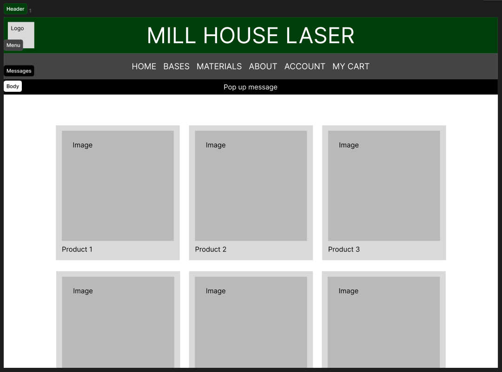
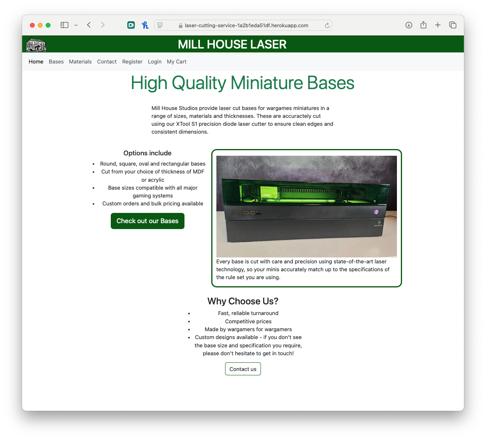
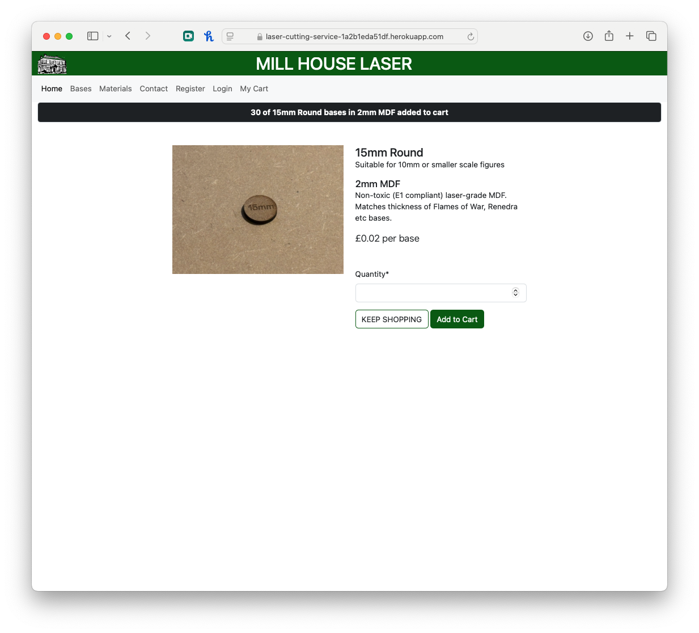
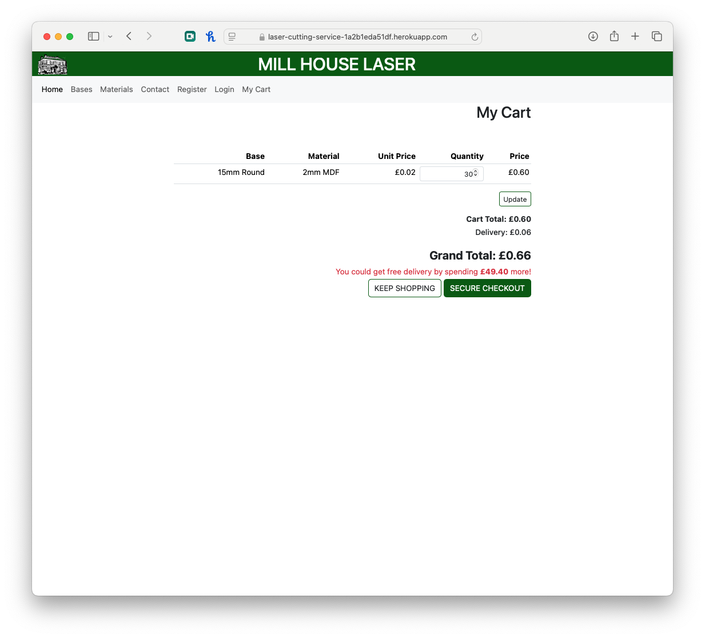
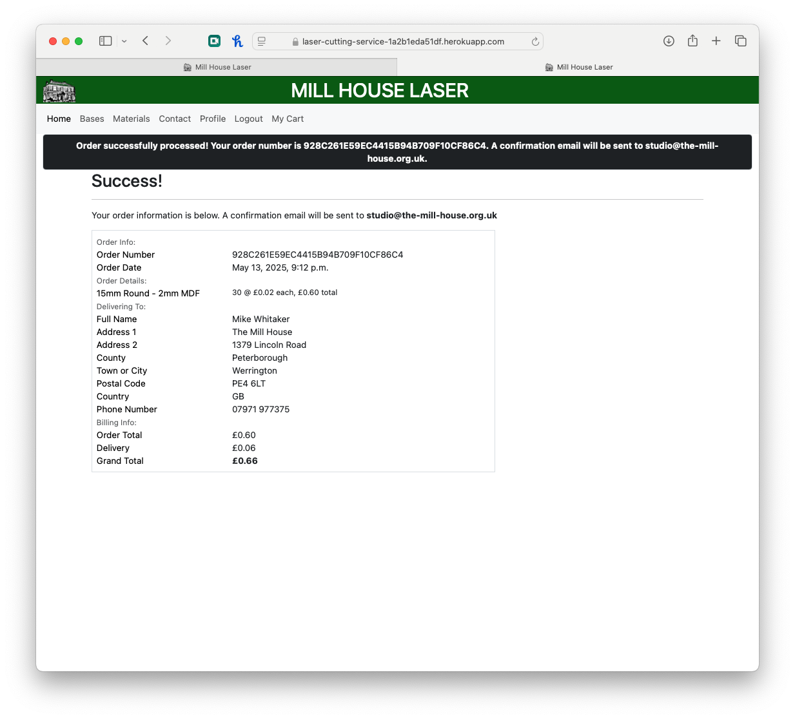
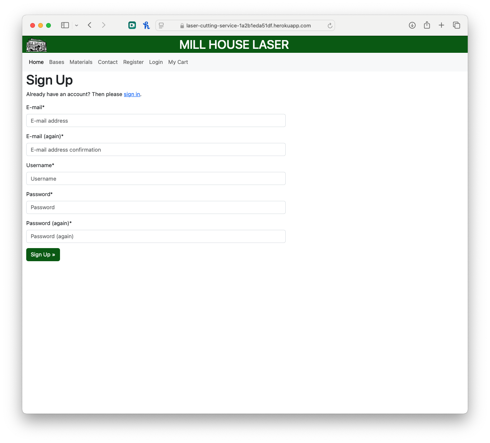
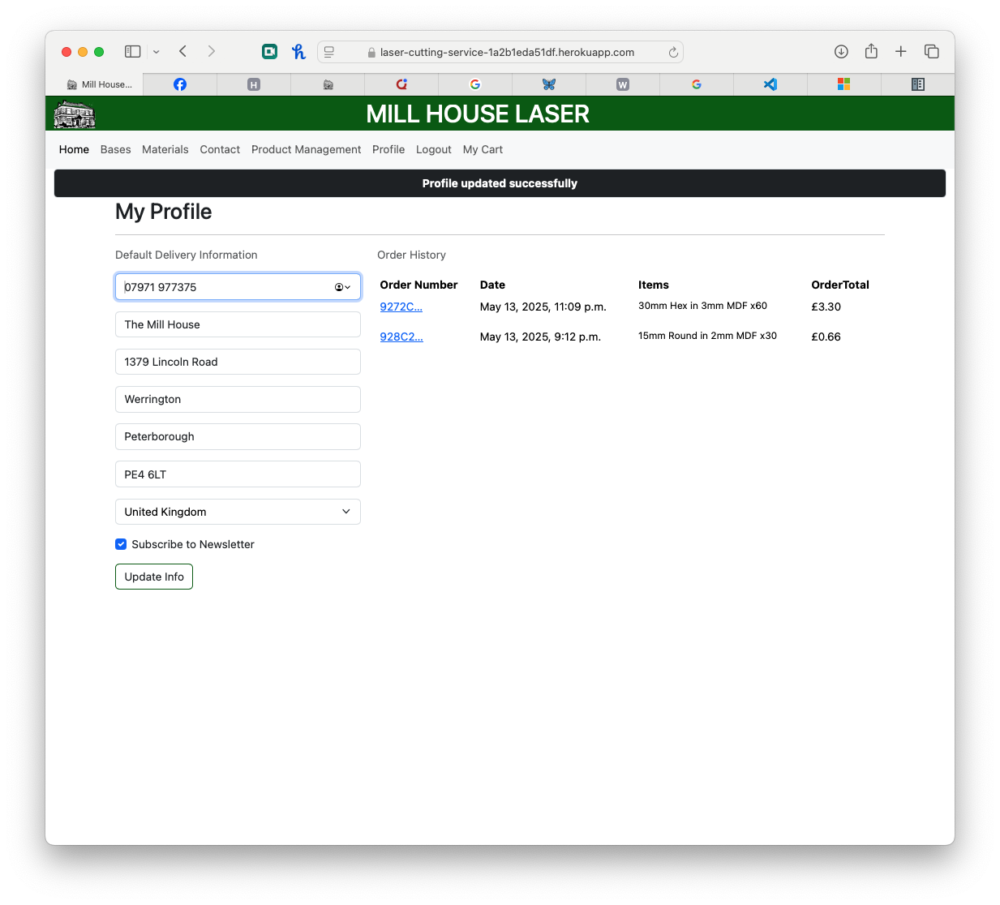
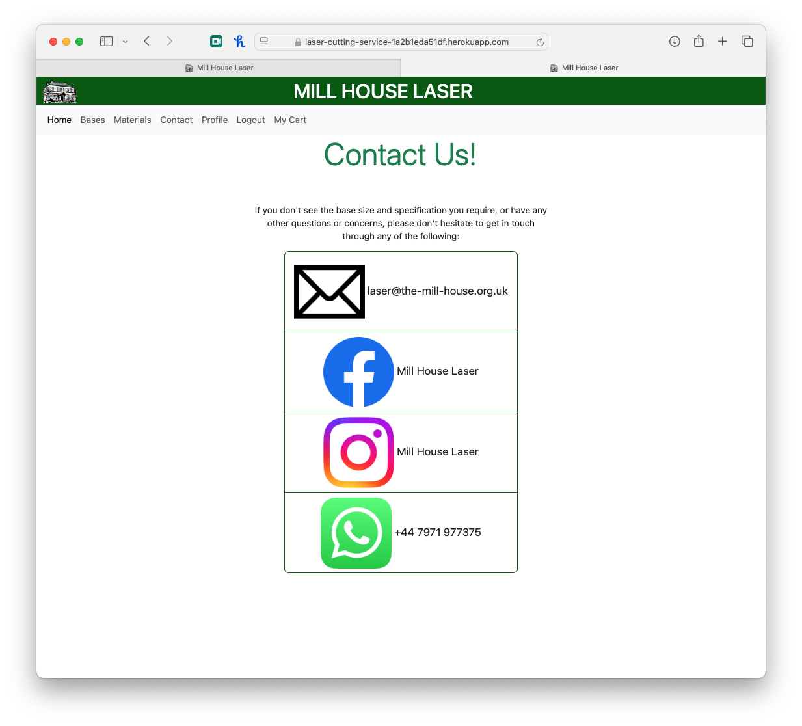
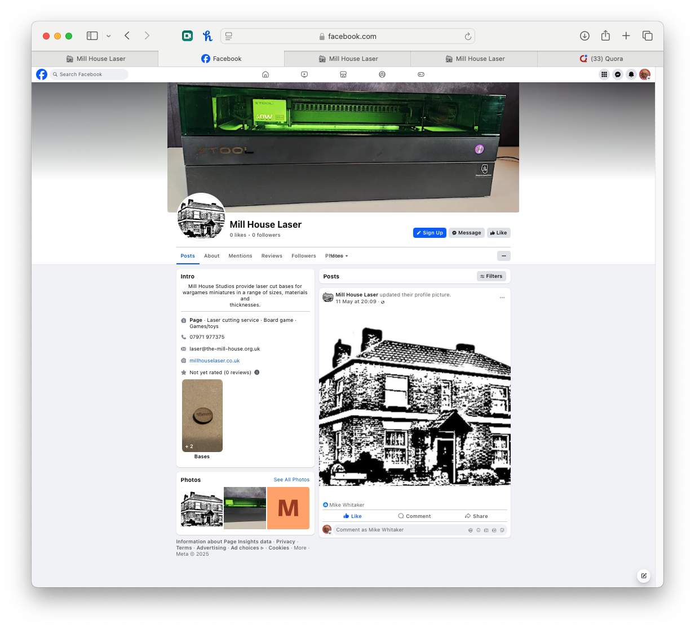
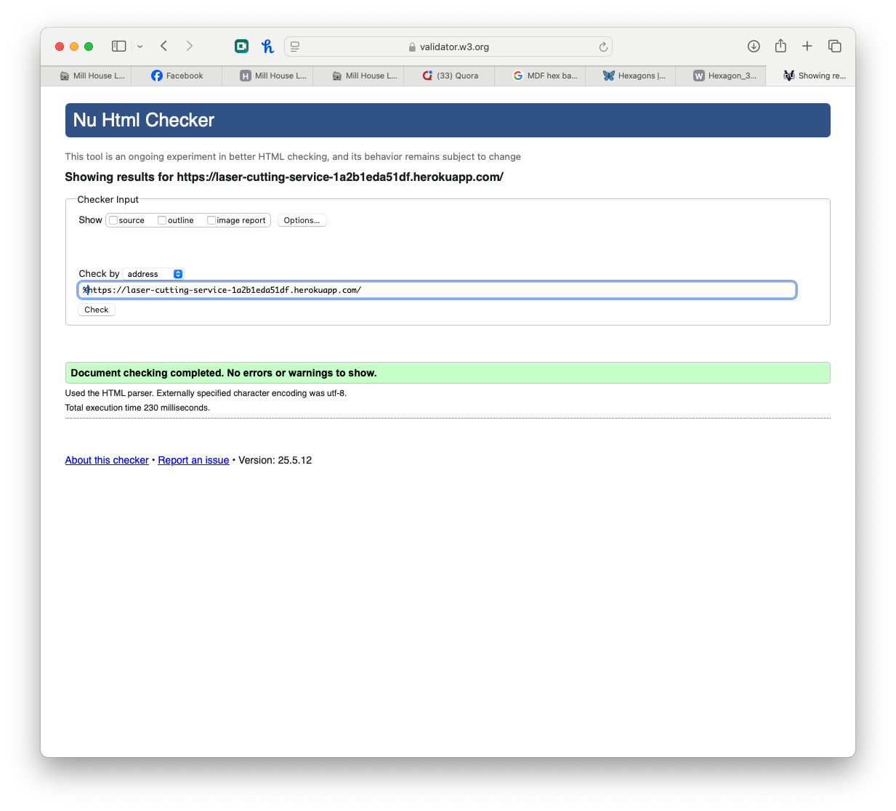

# Mill House Laser

Portfolio 5 project as part of the Diploma in Full Stack Software Development by Code Institute.

---

Mill House Laser is an e-commerse website that sells specialist made bases for wargaming models and miniatures, in a variety of shapes, sizes and materials.

It is a fullstack web application that allows users to browse and purchase from the current catalogue of available bases, and create an account in order to update their billing information and track their previous orders. A user with the appropriate permissions can add new items to the products list.

Link to live site: [https://laser-cutting-service-1a2b1eda51df.herokuapp.com](https://laser-cutting-service-1a2b1eda51df.herokuapp.com)

___

## Site Objectives

My six main objectives were:

- ### Integrate an e-commerce payment system and product structure in a cloud-hosted Full-Stack web application

    I used AWS to store the static files, NeonDB to store the PostgreSQL database for this project, and Heroku to host the website itself.

- ### Employ advanced User Experience Design to build a commercial-grade Full Stack Web Application

    I wanted to make the site easily accessible and intuitively navigated for the users. Django and Bootstrap were used to create and style the front end.

- ### Employ Search Engine Optimisation (SEO) techniques to improve audience reach

    I have added the appropriate meta description and keyword tags, sitemap and robots.txt file, and written suitable optimised content for the website.

- ### Create a secure Full Stack Web application that incorporates Authentication and role-based Authorisation functionality

    I used django-allauth to impliment user autherntication and autherisation.

- ### Employ marketing techniques to create brand reach

    I have created a Facebook page for my website, and a means of signing up for a newsletter.

- ### Understand the fundamentals of E-commerce applications

    The business model has been documented in the README.

___

# User Experience/UX

## Target Audience

- Wargamers, and model and miniature figure collectors.

## User Stories

### New Visitor Goals

- Understand what the site and content is about.
- Understand how to navigate the site.
- View bases and make a purchase.
- Create an account.

### Existing Visitor Goals

- Log in and out of their account.
- Recover their account by resetting password
- View their profile and make updates to it.
- Sign up to the newsletter
- As a admin: keep the store up to date with new items for purchase.

# Design

## Wireframes

# Data model
## Products
### Shape
- Name: CharField(255)
    - Name of the shape
- Description: TextField
    - Description of the shape

### Base
- Shape: ForeignKey
    - References shape model instance
- Size: Charfield(255)
    - Size of the base, including units
- Description: TextField
    - Description of the base
- Number per sheet: DecimalField(5)
    - How many of the base fit on an A4 sheet of material
- Image: ImageField
    - Image of the base

### Material
- Name: CharField(255)
    - Name of the material
- Description: TextField
    - Description of the material
- Cost per sheet: DecimalField(5)
    - Cost per A4 sheet
- Image: ImageField
    - Image of the material

## Checkout
### Order
- Order number: CharField(32)
- User profile: ForeignKey
    - References User profile model instance
- Full name: CharField(50)
- Email: EmailField(254)
- Phone number: Charfield(20)
- Country: CountryField
    - Uses django_countries
- Postcode: Charfield(20)
- Town or city: Charfield(40)
- Street address1: Charfield(80)
- Street address2: Charfield(80)
- County: Charfield(80)
- date: DateTimeField
    - Uses current date and time on creation
- Delivery cost: DecimalField(6)
- Order total: DecimalField(10)
- Grand total: DecimalField(10)
    - Order total + Delivery cost
- Original cart: TextField
    - JSON dump of the shopping cart
- Stripe PID: CharField(254)
    - Stripe payment ID

### OrderLineItem
- Order: ForeignKey
    - References Order model instance
- Base: ForeignKey
    - References Base model instance
- Material: ForeignKey
    - References Material model instance
- Unit price: DecimalField(6)
    - Price of a single base
- Quantity: IntegerField
    - Number of bases
- Lineitem total: DecimalField(6)
    - Unit price x Quantity

## Profiles
### UserProfile
- User: OneToOneField
    - References User model instance
- Default Phone number: Charfield(20)
- Default Country: CountryField
    - Uses django_countries
- Default Postcode: Charfield(20)
- Default Town or city: Charfield(40)
- Default Street address1: Charfield(80)
- Default Street address2: Charfield(80)
- Default County: Charfield(80)

# Features

## Existing Features

Homepage with explaination of site and links

View a list of bases and materials

The user can add a base to their cart, and then view and edit their cart contents

The user can purchase the items in their cart via checkout, and recieve a confirmation page and email

The user can log in or register an account

A logged in user can go to their profile to see their previous orders, update their billing information, and subscribe to the newsletter.

Contact page with link to socials and email

A Facebook page for the website

## Future Features

- Allow for materials of sizes other than A4
- Calculate the minimum amount of material needed to fulfil an order from the sizes of bases in that order
- Allow users to request custom base shapes, sizes and materials not listed
- More sophisticated shipping calculations

# Technologies Used

Here are the technologies used to build this project:

- [VSCode](https://code.visualstudio.com) To build and create this project
- [Github](https://github.com) To host and store the data for the site.
- [PEP8 Validator](https://pep8ci.herokuapp.com/) Used to check python code for errors
- [NeonDB](https://www.neon.tech/) Used to store PostgreSQL database.
- [Heroku](https://id.heroku.com/) Used to deploy the project
- [AWS S3](https://aws.amazon.com/s3/aws) Used to store static files

# Programming Languages, Frameworks and Libraries Used

- [HTML](https://developer.mozilla.org/en-US/docs/Web/HTML)
- [CSS](https://developer.mozilla.org/en-US/docs/Learn/Getting_started_with_the_web/CSS_basics)
- [Python](https://en.wikipedia.org/wiki/Python_(programming_language))
- [Django](https://www.djangoproject.com/)
- [Bootstrap](https://getbootstrap.com/)
- [CrispyForms](https://django-crispy-forms.readthedocs.io/)
- [Crispy-Boostrap](https://pypi.org/project/crispy-bootstrap5/)
- [Pillow](https://pypi.org/project/pillow/)
- [Django Allauth](https://docs.allauth.org)
- [Stripe](https://stripe.com)
- [Boto3](https://pypi.org/project/boto3)

# Agile

This project was designed using Agile methodology, utilising the Project Board and Issues sections in GitHub

- [Project Board](https://github.com/users/Jamzieeeee/projects/5)

# Testing 

## Manual Testing

### As User
| TEST | OUTCOME | PASS/FAIL|
|:---:|:---:|:---:|
| Can create an account | Created successfully | Pass |
| Receive account confirmation email | Email Received and account confirmed | Pass |
| Can log in | Logged in successfully | Pass |
| Can log out | Logged out successfully | Pass |
| Can reset password via email | Email Received and password reset | Pass |
| See different navigation bar when logged in | Page loaded correctly | Pass |
| Can view profile | Page loaded correctly | Pass |
| Can edit billing information | Info updated successfully | Pass |
| Can view bases page | Page loaded correctly | Pass |
| Can view materials page | Page loaded correctly | Pass |
| Can view base detail page | Page loaded correctly | Pass |
| Can add item to cart | Item added successfully | Pass |
| Can view cart | Page loaded correctly | Pass |
| Can edit item in cart | Item edited successfully | Pass |
| Can delete item from cart | Item deleted successfully | Pass |
| Cannot access product management page | Access denied | Pass |
| Can go to checkout page from cart | Page loaded correctly | Pass |
| Can input billing address and card details | Data validated correctly | Pass |
| Order information is sent to stripe | Order info received by stripe | Pass |
| Receive order confirmation email | Email Received | Pass |
| Can view completed orders in profile | Page loaded correctly | Pass |
| Can view contact page and visit all links | Page loaded correctly, all links open in new tab | Pass |

### As Admin
| TEST | OUTCOME | PASS/FAIL |
|:---:|:---:|:---:|
| Can view product management controls | Create, edit, and delete visible | Pass |
| Can add item to shape | Item added successfully | Pass |
| Can edit item in shape | Item edited successfully | Pass |
| Can delete item in shape | Item deleted successfully | Pass |
| Can add item to base | Item added successfully | Pass |
| Can edit item in base | Item edited successfully | Pass |
| Can delete item in base | Item deleted successfully | Pass |
| Can add item to material | Item added successfully | Pass |
| Can edit item in material | Item edited successfully | Pass |
| Can delete item in material | Item deleted successfully | Pass |
| Can upload new item image | Item image uploaded successfully | Pass |
| Cannot add item with illegal form values | Error message displayed | Pass |

## Validator Testing 

### Lighthouse
Testing the homepage.

Note that this is the second run of the test: the first run had a performance score of 51, which I suspect this is due to being run immediately after the server was restarted and thus having to wait for python modules to load in the background.

The Best Practices score is lower than ideal because of 3rd party cookies from Stripe polluting the environment.

### HTML/CSS
Testing the homepage, bases, materials, cart, checkout, profile and product management pages. A couple of small errors were found and rectified.

### Python
Python validation was done via the VSCode [Flake8](https://flake8.pycqa.org/en/latest/) plugin.

A number of errors and whitespace issues were found and rectified.

## Bugs
### Resolved Bugs
- An issue was found where deleting a base from the inventory that was also in a user's cart caused the site to crash with a 404 error on every page. This was due to the code in context.py trying to look up the base ID in the database via `get_object_or_404()`. This was replaced by wrapping a call to `get()` in an exception handler, and removing the base from the user's cart if the call fails.
- Deployment of static content to AWS S3 failed. This turned out to be due to the `STATICFILES_STORAGE` and `DEFAULT_FILE_STORAGE` settings (as used in the Boutique Ado example codebase) being removed in Django version 5.
- The Stripe javascript failed to load. This turned out to be due it being loaded via an insecure HTTP URL when the rest of the site was being loaded via HTTPS on Heroku.
- Proceeding to the checkout with a cart of value less than £0.30 would return a 500 error. This was a limitation of Stripe I was not aware of, and I have disabled the checkout button if the cart value is less than £0.30.
- The checkout button would sometimes be greyed out with a cart of exactly £0.30. This was because the actual total was less than £0.30 but was rounded up by the template. I have fixed this by rounding the grand total in the contexts file. 

### Unfixed Bugs

- The Heroku server sometimes returns a 500 error, which goes away after a page refresh. I have not been able to track the cause of this down.
- My tutor has reported duplicate orders appearing in the database on checkout completion. I have not been able to reproduce this.

# Deployment

## Github Deployment

The website was stored using GitHub for storage of data and version control. To do this I did the following;

After each addition, change or removal of code, in the terminal within your IDE (I used codeanywhere for this project) type:

- git add .
- git commit -m "meaningful commit message"
- git push

The files are now available to view within your github repository.

## Creating a Fork or Copying

To clone/fork/copy the repository you click on the fork tab which is situated next to unwatch tab in the top right corner of the page

## Clone

To create a clone you do the following;

1. Click on the code tab, left of the Gitpod tab
2. To the right of the repository name, click the clipboard icon
3. In the IED open GitBash
4. Change the working directory to the location you prefer
5. Add Git Clone with the copy of the repository name
6. Clone has been created

## Repository deployment via Heroku

- On the [Heroku Dashboard](https://dashboard.heroku.com) page, click New and then select Create New App from the drop-down menu.
- When the next page loads insert the App name and Choose a region. Then click 'Create app'
- You will need the connection details for AWS, Stripe, and email accounts.
- In the settings tab click on Reveal Config Vars and add values for the following variables:
    - AWS_ACCESS_KEY_ID
    - AWS_S3_REGION_NAME
    - AWS_SECRET_ACCESS_KEY
    - AWS_STORAGE_BUCKET_NAME
    - DATABASE_URL
    - EMAIL_HOST_PASS
    - EMAIL_HOST_USER
    - SECRET_KEY
    - STRIPE_PUBLIC_KEY
    - STRIPE_SECRET_KEY
    - STRIPE_WH_SECRET
    - USE_AWS (True)

### Deployment of the app

- Click on the Deploy tab and select Github-Connect to Github.
- Enter the repository name and click Search.
- Choose the repository that holds the correct files and click Connect.
- A choice is offered between manual or automatic deployment whereby the app is updated when changes are pushed to GitHub.
- Once the deployment method has been chosen the app will be built and can be launched by clicking the Open app button which should appear below the build information window, alternatively, there is another button located in the top right of the page.

## Initial Product data load

- Run `python manage.py loaddata products/fixtures/products.json` to load the current product catalogue into the database

# Credits 

## Content 
The initial project structure was based on Code Institute's 'Boutique Ado' project. 

I referred to code examples from the following sites to build the project:
- [Bootstrap docs](https://getbootstrap.com/docs/5.3/getting-started/introduction/)
    - For bootstrap styling
- [GeeksforGeeks](https://geeksforgeeks.org)
    - For django views and bootstrap styling
- [Django docs](https://docs.djangoproject.com)
    - For code examples and reference
- [W3Schools](https://w3schools.com)
    - For code examples and reference

The Readme layout was based indirectly (via [Mark Daniel](https://github.com/markdaniel1982/MD82-P4/blob/main/README.md)) on the example by [Kera Cudmore - Readme Examples](https://github.com/kera-cudmore/readme-examples/blob/main/README.md?plain=1) and [Sdalsosa - Readme](https://github.com/Sdalsosa/ComposerHub/blob/main/README.md)

The wireframe mockups were created using [Figma](https://www.figma.com/)

## Media
- Logo/Favicon is taken from [https://www.the-mill-house.org.uk/](https://www.the-mill-house.org.uk/) with permission.
- Laser cutter image taken from [https://xtool.com/](https://xtool.com/).
- Base samples given by Mike Whitaker, base images taken by myself.
- Material images taken from [https://kitronik.co.uk](https://kitronik.co.uk).
- Social media icons from [https://iconfinder.com](https://iconfinder.com).

## Acknowledgments and Thanks

Spencer Barriball my Code Institute mentor.

Kieron Pierson and Jeantelle van Niekerk from the Student Care team.

Mike Whitaker, my father and customer for this project.
